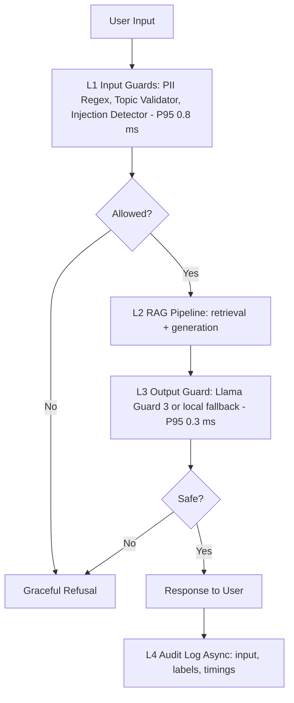

# Production Blueprint: RAG Evaluation and Guardrail System

## 1. SLO Definition

| Metric | Target | Alert Threshold | Severity |
|---|---:|---:|---|
| Faithfulness | >= 0.85 | < 0.80 for 30 min | P2 |
| Answer Relevancy | >= 0.80 | < 0.75 for 30 min | P2 |
| Context Precision | >= 0.70 | < 0.65 for 1h | P3 |
| Context Recall | >= 0.75 | < 0.70 for 1h | P3 |
| P95 Latency with guardrails | < 2.5s | > 3s for 5 min | P1 |
| Guardrail Detection Rate | >= 90% | < 85% per regression run | P2 |
| False Positive Rate | < 5% | > 10% per regression run | P2 |

## 2. Architecture Diagram

The system uses defense in depth. L1 removes sensitive data and blocks off-topic or injected prompts. L2 generates a grounded answer from retrieved context. L3 checks the assistant response for unsafe content. L4 stores audit events asynchronously so logging does not add user-facing latency.

## 3. Alert Playbook

### Incident: Faithfulness drops below 0.80

**Severity:** P2
**Detection:** Continuous RAGAS eval alert.
**Likely causes:** bad retrieval chunks, prompt drift, or corpus updated without re-indexing.
**Investigation steps:** compare context precision in the same window, inspect prompt version diff, and review document ingestion logs.
**Resolution:** re-index corpus, tune retriever top-k/reranker, or roll back prompt.
**SLO impact:** track time to detect and time to recover.

### Incident: Guardrail detection rate drops below 85%

**Severity:** P2
**Detection:** Nightly adversarial regression suite.
**Likely causes:** new jailbreak pattern, regex regression, or topic guard threshold too permissive.
**Investigation steps:** group missed attacks by type, replay against injection detector, and inspect latest allowlist changes.
**Resolution:** add missed patterns to test set, update classifier rules, and require review before relaxing scope checks.
**SLO impact:** block release until the regression suite passes.

### Incident: P95 latency exceeds 3 seconds

**Severity:** P1
**Detection:** Production latency monitor.
**Likely causes:** slow LLM provider, Llama Guard API latency, or sequential guardrail execution.
**Investigation steps:** break down L1/L2/L3 timings, compare baseline RAG latency, and check provider status.
**Resolution:** run L1 checks in parallel, cache topic embeddings, switch to local Llama Guard or degrade to local fallback during provider incidents.
**SLO impact:** notify users if degraded mode is enabled.

## 4. Cost Analysis

Assumption: 100k queries/month, 1% continuous RAGAS sample, 10% judge sample, and self-hosted Llama Guard.

| Component | Unit Cost | Volume | Monthly Cost |
|---|---:|---:|---:|
| RAG generation with GPT-4o-mini | $0.001/query | 100k | $100 |
| RAGAS continuous eval | $0.01/query | 1k | $10 |
| LLM judge tier 2 | $0.001/query | 10k | $10 |
| LLM judge tier 3 | $0.05/query | 1k | $50 |
| Presidio or regex PII redaction | $0 | 100k | $0 |
| Llama Guard 3 self-hosted GPU | $0.30/hour | 720h | $216 |
| Total |  |  | $386 |

Cost optimizations: use tiered judge sampling, run expensive judge only on low-confidence cases, tune eval sample size by traffic, and switch Llama Guard between API and self-hosted based on utilization.
